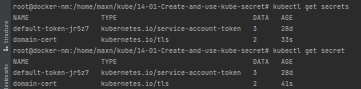
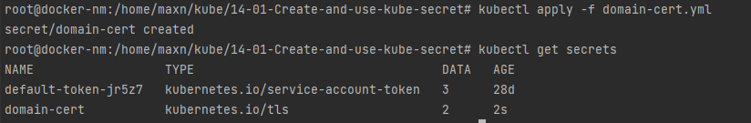

# 14-01-Create-and-use-kube-secret

### Создание секрета


### Список секретов





### Посмотреть секрет


### Секрет в YAML

```shell
root@docker-nm:/home/maxn/kube/14-01-Create-and-use-kube-secret# kubectl get secret domain-cert -o yaml
apiVersion: v1
data:
  tls.crt: LS0tLS1CRUdJTiBDRVJUSUZJQ0FURS0tLS0tCk1JSUZlVENDQTJHZ0F3SUJBZ0lVQjRrZk5sUTk1Z0hibVJDaG9MUmVONnNYZzN3d0RRWUpLb1pJaHZjTkFRRUwKQlFBd1RERUxNQWtHQTFVRUJoTUNVbFV4RWpBUUJnTlZCQWdNQ1V0eVlYTnViMlJoY2pFU01CQUdBMVVFQnd3SgpTM0poYzI1dlpHRnlNUlV3RXdZRFZRUUREQXh6WlhKMlpYSXViRzlqWVd3d0hoY05Nakl3TlRJeU1EWTFNVFE1CldoY05Nekl3TlRFNU1EWTFNVFE1V2pCTU1Rc3dDUVlEVlFRR0V3SlNWVEVTTUJBR0ExVUVDQXdKUzNKaGMyNXYKWkdGeU1SSXdFQVlEVlFRSERBbExjbUZ6Ym05a1lYSXhGVEFUQmdOVkJBTU1ESE5sY25abGNpNXNiMk5oYkRDQwpBaUl3RFFZSktvWklodmNOQVFFQkJRQURnZ0lQQURDQ0Fnb0NnZ0lCQU1jU3NCWUk2ZVd5NjBuQ0NFaGkyUDNqCkRITXptNkRGRmp0UDllRlVxY1ZWVm5Sa1A1ZTBVUndUQWFnOU5MOHk0NnBBVS9LYXRCeHRoN1FvMzgvZ3dVS2wKbm1ZQ1lEYkZmNDNZNkVtSGpjcnhCU0VmQ0M3dVBKcVVpa01wL2gwWkkvZ2lnRk5pUm42dDRkUklpREh5cUU0Ugp5eWp4bEYzNjRJN1kvUnB4c0Nsc2pWS0d3WHhyNk8zZzhZSERtK2cvSlJKUjdSMHJVQWwwSThxZnVZS1hVZG5vCitzQS91OUNqM0lHZFNyMmI5US8zSnFWNlg4K3RoS0NRZGx6V25KRWhsZTd2dWYrWHh6TkExZHdpa2JpUEVRZGEKYVNuTWxoMldtRHdKRXhVemRUK2l1Zmt1c1JWSFpnUk80amlJNUlWVEZudC83c0gzYUNtM3llTVNZbFFzQlBYMApQQTl3VDdtY3FnK3kwa2tqUmdmT09iSkNlTDBTMGp6Vm1JQS9Ja2hIRTZLaXNBK213M3N5WG5uellkSlN6WXZtCnVNc3Jpb00rY0NjT3RLVEV1RjEwVGo5ZFVXaFBWQzU2MmNINENCdTJmbVFiaXFwYW8zQ1lDeVBtajBjT3lLQkUKVFBnSHNHbU9yencxSVU5NzBlZHNrVnVIM2lRUUZJRUdJbnVROVU1YWdSVnpYZlByR2NGQUEwOFNYL3NCK1NBNgp5YTFNdll5U3dMcXlVayswRmxJNE5SRFNtMWdlQnFzd2dGa2RlOTR4NGtiYS9kTEZPOHpDN09HMkh5UXJuSlBrClV5dzlRRmVtWVFFOVlyUjBRbEFxWDRzZll2cTVUeVBEQmd5S3Y1cTNDOEM0VUc0ZVM5R0ttcjB5eW52a0dBQUUKbTIxM29TVmx0MDRpZEtzMFk4VjVBZ01CQUFHalV6QlJNQjBHQTFVZERnUVdCQlJack0rUFo0dFhiVkU2MVpXcgpKL2drY282dlBEQWZCZ05WSFNNRUdEQVdnQlJack0rUFo0dFhiVkU2MVpXckovZ2tjbzZ2UERBUEJnTlZIUk1CCkFmOEVCVEFEQVFIL01BMEdDU3FHU0liM0RRRUJDd1VBQTRJQ0FRQjZpbnJjb2V0VUJldUhvZG0wR1NqVURWZEsKTVY3em9KYWZIQUxVbWJUMWxZTG81aXlER0QrblcvN3JicnNGUGJHZ0FPSzk3YUdFSy91SHdHQzB5MnVnc3BkaApRenhIOEwyVm9XQnZKZ1VYek5Pb2NNUWwwVW9STU9ncElwRFJXVi9ObktjQXhNQk9tRUpxcEtob1FhU1NiWk1VCkNjMjVmQ0luTDlGS3E2emREdHVKMVFHUGNrZC9XRVVKeHNXTlpKM2dSYkgybXNiR2RvV2drVzBYakRIR3RIaEUKcVRjZklSUEo3RzZqaWg2WVgySExrU2czMXFla3d5MXFNTVV5VjI4UVkwL1ViZ1NZQWhPNDBkOHpLMjRPeXgybQpRUHFVTmdHMm9mTUZWaUJDOVRMR3AxR2VreXIyRnJvK0dHcGpXNkhhWXZKdS9SeDVEUVZkdjZHeXNTRUZ1elBZClY1UG5wWTFsbWFKWmY4MHFmdkQrbkljVnhZT2lzWHdPNzB5Y1VpbVdGb0huUW9meFowSnA2RU9iQTQ4SzV2UWoKcXR3WlZveVRuN29GNU9UNDkxaXlZb2FvdmV0dVNBKzRoQzVaMHlMQWI0YWkzWlBPVDBTblZueGFvWnQ3UXNNNworWGN2NEQwWTVDNjNBSXVoL3VBWUh4Y1A2cDBXUWxYS0ZxazVGY3JnSmpJRVFVZ2tXRk9JTnhDTU01YXYxakZXCkl4K3dITjZPdDdwTWRDanEwaFkzY1RCc0NlaENQRy9kd25hOG9SczAxY0ppMmloQ044STFKd1VZTXFmWEpXK0oKSUpGK1BKaDAzc0k2U3hqU3oyMXVod0ZkbGJqYmtUeGVVMkplUWU4VlpZbThuR05RZzN5ZlZxaDdvRXdha0FyeQp3eUNqOXVBV1JScEo4V3V4UkE9PQotLS0tLUVORCBDRVJUSUZJQ0FURS0tLS0tCg==
  tls.key: LS0tLS1CRUdJTiBSU0EgUFJJVkFURSBLRVktLS0tLQpNSUlKS1FJQkFBS0NBZ0VBeHhLd0ZnanA1YkxyU2NJSVNHTFkvZU1NY3pPYm9NVVdPMC8xNFZTcHhWVldkR1EvCmw3UlJIQk1CcUQwMHZ6TGpxa0JUOHBxMEhHMkh0Q2pmeitEQlFxV2VaZ0pnTnNWL2pkam9TWWVOeXZFRklSOEkKTHU0OG1wU0tReW4rSFJraitDS0FVMkpHZnEzaDFFaUlNZktvVGhITEtQR1VYZnJnanRqOUduR3dLV3lOVW9iQgpmR3ZvN2VEeGdjT2I2RDhsRWxIdEhTdFFDWFFqeXArNWdwZFIyZWo2d0QrNzBLUGNnWjFLdlp2MUQvY21wWHBmCno2MkVvSkIyWE5hY2tTR1Y3dSs1LzVmSE0wRFYzQ0tSdUk4UkIxcHBLY3lXSFphWVBBa1RGVE4xUDZLNStTNngKRlVkbUJFN2lPSWpraFZNV2UzL3V3ZmRvS2JmSjR4SmlWQ3dFOWZROEQzQlB1WnlxRDdMU1NTTkdCODQ1c2tKNAp2UkxTUE5XWWdEOGlTRWNUb3FLd0Q2YkRlekplZWZOaDBsTE5pK2E0eXl1S2d6NXdKdzYwcE1TNFhYUk9QMTFSCmFFOVVMbnJad2ZnSUc3WitaQnVLcWxxamNKZ0xJK2FQUnc3SW9FUk0rQWV3YVk2dlBEVWhUM3ZSNTJ5Ulc0ZmUKSkJBVWdRWWllNUQxVGxxQkZYTmQ4K3Nad1VBRFR4SmYrd0g1SURySnJVeTlqSkxBdXJKU1Q3UVdVamcxRU5LYgpXQjRHcXpDQVdSMTczakhpUnRyOTBzVTd6TUxzNGJZZkpDdWNrK1JUTEQxQVY2WmhBVDFpdEhSQ1VDcGZpeDlpCitybFBJOE1HRElxL21yY0x3TGhRYmg1TDBZcWF2VExLZStRWUFBU2JiWGVoSldXM1RpSjBxelJqeFhrQ0F3RUEKQVFLQ0FnQXRUN2FldlZhbnZzckpWZzNXbEJFNThLVVR6NnBidEtCenphWjBySFdjQWVtVXdvQ3JBaEw0SmVkWgpxTnpKckVhZnFOYXl3TDNBUHJvRnFzd09uK1M5Uzc4N0RzMWhpaUNYWThpemU5UXRYaURCd2pOMW95cE9NUU1yCmVISnJveDVKeTJpVUVpbGppaVo5MENpWDNkaXJOR2Vlb1NZWkloSmMwVTBDNk4ray9oMUlySDE3MllBQ0xSSXIKYkIrZmhFZm0zSmp3Njd2aSt2bHVsRjZBTi9zY2MyZ252Qm4reWwxVmJ6emszWXV4SDVzL1RSUmp5K1lGT2Z5Rwo4eDVkOWx3UEw2ZVJZcldubDlsVnF0U3FRbjRvdzA1dWdpK2srbk1hTHlLVno4bWZPMlhETHZxRmttUEpGVDl1CmlOSWkrcCtDYXNNb2lTeS9XaUxzdVhHQ0lTYmJnZVluRmNtT2tGNUZGVERoVWtjLzFFTk5relpWRVVlbmtRWlMKV0U4SjBsR1NvR1l3QnQrVFNrNHpYd1RFYUJsWWx1RDRURTBxbHlTYStwaFhVaUROT3hZSjJLMWpYVExYMzVGTQpkbXIxa2xVeXlxUVovVnpYZDRaRzhROXVsc0M5eEl5d2JZTElYNFlHUVJUM055RlRVNEp5aHJ1cEpUa2hZMThaCmo1YWZ6UUxOVCtyUDJ3VjlUSHRNNll1L0NSbkhUa3ZSemhHbWV4WUVSRHdscXJybTZTQjQwME9wRDhpL0dRdXMKUWNCL1hjdjFITjlFbG0rNFdrT2FrNjg1L2tlVy83ZW5hZ1F6TUozM042MDVXb2l4MVdzQkhFb0JrUjdwVlhBbwpoaVpyUlNHM280dktIV2xKMjZwa2pJRHNxalFsVnlkRWswUGo5WDhUdkVRZm9XQXVrUUtDQVFFQTdBd2Q1VEF2CnpzUGU0ejJHT3FwRk5OWGpqMnBhcGI1MlVzZWJ3MXJpbm5YR1BPUDlVUmlrblZXM21nWUVWcmhGOUl0bjFNSVUKSktiSGpZZzlwTStEZ3BUbkFKYVlQUm4rOGVRUklZSjlnQ0tVSFZIcFhaNjhuK1dSOXV5dG9KTGZRSm12dndXaQpCUGR2Tk9DaFZobzg2b1R2STd2ZkV1QkNjVk0yb016akNGUWlYdDUvNE0xdThCdWthRitPWEFXRWZXSldYNndaCk1WMHJRVjA2YUFmYTZxbU1rcnpSRGhMbWMzNXBZUGJqN3VwRTB1ejY0aThyaHhEMGJXeTB6bXp4bThUVENZYXIKT2ZsbVg3a2ZaV1hydldNV05HTjBmTmlMVTcrM0RMaTZEUmtmWENoZzlJUUpuR1lkYU11MUhhTUVtNXBCZkZJdQpkV2dVV1RmbVBZdDgzUUtDQVFFQTErWjVrVXBWVjZ6eTZ3cFRybkFaWUhJQXUrRDh0enpHOW5QMHVZbDV5SHFoCkNUc0RwS3RNZkE0OVFjSk53Vnc1aU1jMFpiU2hub2RJRTFWaTRLOGRERkhsWWxyUFZ5Q3VxVW9PaTVxczdwZTQKdVlJa3NIOWdreDdpM1ZFNWxHT1JDdTlIb05jR0xES0xhRXpCeDFHMzJHMUljNXhHQ2JYTjQ3RjZWVktQdm9ZVQoyK1dOUElIVGRERUdubU9iejUrTE1kdytLZXBkUHhkb2V1TUg1VjVrMWlVZExtaFVjZTVtSVR4RGZybUIzaU4vClB1UUNYZlNrT0dCRFQyMkFsZW1UUzhuVUVWdHZmRlA1a2VMaWFOOXcxT2NRY3VIRXdQb21FRWJWRVFqSzRGVkwKNC91KzlFZmFoRzhrUXV6U2tDVEd4VFFjdDBFdUVvZDEzUEQ4UklFalRRS0NBUUFabTc3cWpHM0RXdENsaXBregphQ0dWOTlaMlNxMkc2Y0RnZmpOUjRGeFJvS2xmRmNUM3RWcTJqd1FhTzZqZzE2RVBSTWlBOW9WRTdLc2RtYmhHClZ4VUhaNndnRGpaNStvWUVMQ0FIcUthQTdqOXZadUdRZkpZdUtyUEpQQ2dpRVkwUzd4bDMrZDUzOTNnakhuT2kKYWJwT0h4bnFvSWswL1F0NFMvVFRRU2NvVWloZ2JuY2xKbVJ3dkM3Nys5SHYvZEUvNFJsSnk5djMxUW5LVDVqMApqRldkdThNNmNDMmwvenJ0TUx1eC8xYi9KbjlNK3RURkVTVUJ4RDhnVi9qTnBGZ1o5Q0tKR0FrZmd3VXVRV0U4Cm1QQVlYZFdjM1dWWDNnNVBpYThNUEVaREFZUzdkTTMvK1FzcDRwSXlPbGR0M2ErMFNlbnMyT1dkYXlzNStxeUoKNU1ZcEFvSUJBUUM5enlsWG02TldGbjNtTjhrRUZoZXBXL0RiUEZ6UmQ4UndEZGU4ZW1tdjRHZk5acTI0U3NWTwpWM0p4YXJMVGFSSkg5dUpRL0RJTzNsNTJhTjRxTEtuOEY4L3ozV1JsOUJ5NlJwcHREOG96WlA0SlVhcVI1UnB4Cm5YalVIRUhqL0hrYXhPMFRNWmVDcWRrNEZDdFU0Ym9nczBzOElNck9aS0NqS25nanBSY3M2RkpVVlFjTGlCUHcKRmQzOHlCUEd3RHd1MUxOdVJGWkFUb01UYnArVmZweG1USERRU1BiY3h6dlF3bHVRZ09UMDkvNDV1MWw5WXNReApzQ2ZkSDZjcHBSVlRUeGg3UGdqUXBEOUlpOUNEWk5XY3g1d0ZkQWwzb3pSdG9PaFhOb1N1SHk4K095aFJPUTZhCjJkOW1XekJ2ZTNXcEVEeWl1OUlXaGpNUDBHbm9qQ1FOQW9JQkFRQzVDY1EvVlpPUTJUdmNsL0pIQjFVRTRsMnMKWGFFQzhFQzVGR2JJU2diRnVHeVUyVk9PYXFsQTd1WnprNW45c1NJN3JWK2dicjk3cVRpRHNIN1dDUTZ0Z2dURQpQeXZYeFBQc1d1NVFtWkZaWWxJNndGUzA2RHdQSWFDY29XVHk1S2NNTUkyQVRJcnJ2YnpCR3JBMDJRaGRTS21ZCmNWdlR6ckgrQkJldVlUbHJqdmVmckU2ZVZWOGtqT2NZa2VFR3lwQnQ0T1kzZ05MOS9jemhVcW41Nml4Y0NscTcKNEJxRXhCaUdpQlVzUWFoNEdXdkZqMFcwRnBZWlkycW4xS21EaTNPa2pkb1kvZGFNUDFsd0c5SkRkeWYyL2FVawpJeUxuaXBhYWV4K2twaXVOblV3ZmJldkRxSVFHUlRaM0NkdTgraXVaRUxlbVhYM0ZjSEZDSFlKSXRBVUMKLS0tLS1FTkQgUlNBIFBSSVZBVEUgS0VZLS0tLS0K
kind: Secret
metadata:
  creationTimestamp: "2022-05-22T06:53:09Z"
  name: domain-cert
  namespace: prod
  resourceVersion: "6473245"
  uid: b845a8a4-3854-403a-bffe-7c269433da6f
type: kubernetes.io/tls

```

### Секрет в JSON

```shell
root@docker-nm:/home/maxn/kube/14-01-Create-and-use-kube-secret# kubectl get secret domain-cert -o json
{
    "apiVersion": "v1",
    "data": {
        "tls.crt": "LS0tLS1CRUdJTiBDRVJUSUZJQ0FURS0tLS0tCk1JSUZlVENDQTJHZ0F3SUJBZ0lVQjRrZk5sUTk1Z0hibVJDaG9MUmVONnNYZzN3d0RRWUpLb1pJaHZjTkFRRUwKQlFBd1RERUxNQWtHQTFVRUJoTUNVbFV4RWpBUUJnTlZCQWdNQ1V0eVlYTnViMlJoY2pFU01CQUdBMVVFQnd3SgpTM0poYzI1dlpHRnlNUlV3RXdZRFZRUUREQXh6WlhKMlpYSXViRzlqWVd3d0hoY05Nakl3TlRJeU1EWTFNVFE1CldoY05Nekl3TlRFNU1EWTFNVFE1V2pCTU1Rc3dDUVlEVlFRR0V3SlNWVEVTTUJBR0ExVUVDQXdKUzNKaGMyNXYKWkdGeU1SSXdFQVlEVlFRSERBbExjbUZ6Ym05a1lYSXhGVEFUQmdOVkJBTU1ESE5sY25abGNpNXNiMk5oYkRDQwpBaUl3RFFZSktvWklodmNOQVFFQkJRQURnZ0lQQURDQ0Fnb0NnZ0lCQU1jU3NCWUk2ZVd5NjBuQ0NFaGkyUDNqCkRITXptNkRGRmp0UDllRlVxY1ZWVm5Sa1A1ZTBVUndUQWFnOU5MOHk0NnBBVS9LYXRCeHRoN1FvMzgvZ3dVS2wKbm1ZQ1lEYkZmNDNZNkVtSGpjcnhCU0VmQ0M3dVBKcVVpa01wL2gwWkkvZ2lnRk5pUm42dDRkUklpREh5cUU0Ugp5eWp4bEYzNjRJN1kvUnB4c0Nsc2pWS0d3WHhyNk8zZzhZSERtK2cvSlJKUjdSMHJVQWwwSThxZnVZS1hVZG5vCitzQS91OUNqM0lHZFNyMmI5US8zSnFWNlg4K3RoS0NRZGx6V25KRWhsZTd2dWYrWHh6TkExZHdpa2JpUEVRZGEKYVNuTWxoMldtRHdKRXhVemRUK2l1Zmt1c1JWSFpnUk80amlJNUlWVEZudC83c0gzYUNtM3llTVNZbFFzQlBYMApQQTl3VDdtY3FnK3kwa2tqUmdmT09iSkNlTDBTMGp6Vm1JQS9Ja2hIRTZLaXNBK213M3N5WG5uellkSlN6WXZtCnVNc3Jpb00rY0NjT3RLVEV1RjEwVGo5ZFVXaFBWQzU2MmNINENCdTJmbVFiaXFwYW8zQ1lDeVBtajBjT3lLQkUKVFBnSHNHbU9yencxSVU5NzBlZHNrVnVIM2lRUUZJRUdJbnVROVU1YWdSVnpYZlByR2NGQUEwOFNYL3NCK1NBNgp5YTFNdll5U3dMcXlVayswRmxJNE5SRFNtMWdlQnFzd2dGa2RlOTR4NGtiYS9kTEZPOHpDN09HMkh5UXJuSlBrClV5dzlRRmVtWVFFOVlyUjBRbEFxWDRzZll2cTVUeVBEQmd5S3Y1cTNDOEM0VUc0ZVM5R0ttcjB5eW52a0dBQUUKbTIxM29TVmx0MDRpZEtzMFk4VjVBZ01CQUFHalV6QlJNQjBHQTFVZERnUVdCQlJack0rUFo0dFhiVkU2MVpXcgpKL2drY282dlBEQWZCZ05WSFNNRUdEQVdnQlJack0rUFo0dFhiVkU2MVpXckovZ2tjbzZ2UERBUEJnTlZIUk1CCkFmOEVCVEFEQVFIL01BMEdDU3FHU0liM0RRRUJDd1VBQTRJQ0FRQjZpbnJjb2V0VUJldUhvZG0wR1NqVURWZEsKTVY3em9KYWZIQUxVbWJUMWxZTG81aXlER0QrblcvN3JicnNGUGJHZ0FPSzk3YUdFSy91SHdHQzB5MnVnc3BkaApRenhIOEwyVm9XQnZKZ1VYek5Pb2NNUWwwVW9STU9ncElwRFJXVi9ObktjQXhNQk9tRUpxcEtob1FhU1NiWk1VCkNjMjVmQ0luTDlGS3E2emREdHVKMVFHUGNrZC9XRVVKeHNXTlpKM2dSYkgybXNiR2RvV2drVzBYakRIR3RIaEUKcVRjZklSUEo3RzZqaWg2WVgySExrU2czMXFla3d5MXFNTVV5VjI4UVkwL1ViZ1NZQWhPNDBkOHpLMjRPeXgybQpRUHFVTmdHMm9mTUZWaUJDOVRMR3AxR2VreXIyRnJvK0dHcGpXNkhhWXZKdS9SeDVEUVZkdjZHeXNTRUZ1elBZClY1UG5wWTFsbWFKWmY4MHFmdkQrbkljVnhZT2lzWHdPNzB5Y1VpbVdGb0huUW9meFowSnA2RU9iQTQ4SzV2UWoKcXR3WlZveVRuN29GNU9UNDkxaXlZb2FvdmV0dVNBKzRoQzVaMHlMQWI0YWkzWlBPVDBTblZueGFvWnQ3UXNNNworWGN2NEQwWTVDNjNBSXVoL3VBWUh4Y1A2cDBXUWxYS0ZxazVGY3JnSmpJRVFVZ2tXRk9JTnhDTU01YXYxakZXCkl4K3dITjZPdDdwTWRDanEwaFkzY1RCc0NlaENQRy9kd25hOG9SczAxY0ppMmloQ044STFKd1VZTXFmWEpXK0oKSUpGK1BKaDAzc0k2U3hqU3oyMXVod0ZkbGJqYmtUeGVVMkplUWU4VlpZbThuR05RZzN5ZlZxaDdvRXdha0FyeQp3eUNqOXVBV1JScEo4V3V4UkE9PQotLS0tLUVORCBDRVJUSUZJQ0FURS0tLS0tCg==",
        "tls.key": "LS0tLS1CRUdJTiBSU0EgUFJJVkFURSBLRVktLS0tLQpNSUlKS1FJQkFBS0NBZ0VBeHhLd0ZnanA1YkxyU2NJSVNHTFkvZU1NY3pPYm9NVVdPMC8xNFZTcHhWVldkR1EvCmw3UlJIQk1CcUQwMHZ6TGpxa0JUOHBxMEhHMkh0Q2pmeitEQlFxV2VaZ0pnTnNWL2pkam9TWWVOeXZFRklSOEkKTHU0OG1wU0tReW4rSFJraitDS0FVMkpHZnEzaDFFaUlNZktvVGhITEtQR1VYZnJnanRqOUduR3dLV3lOVW9iQgpmR3ZvN2VEeGdjT2I2RDhsRWxIdEhTdFFDWFFqeXArNWdwZFIyZWo2d0QrNzBLUGNnWjFLdlp2MUQvY21wWHBmCno2MkVvSkIyWE5hY2tTR1Y3dSs1LzVmSE0wRFYzQ0tSdUk4UkIxcHBLY3lXSFphWVBBa1RGVE4xUDZLNStTNngKRlVkbUJFN2lPSWpraFZNV2UzL3V3ZmRvS2JmSjR4SmlWQ3dFOWZROEQzQlB1WnlxRDdMU1NTTkdCODQ1c2tKNAp2UkxTUE5XWWdEOGlTRWNUb3FLd0Q2YkRlekplZWZOaDBsTE5pK2E0eXl1S2d6NXdKdzYwcE1TNFhYUk9QMTFSCmFFOVVMbnJad2ZnSUc3WitaQnVLcWxxamNKZ0xJK2FQUnc3SW9FUk0rQWV3YVk2dlBEVWhUM3ZSNTJ5Ulc0ZmUKSkJBVWdRWWllNUQxVGxxQkZYTmQ4K3Nad1VBRFR4SmYrd0g1SURySnJVeTlqSkxBdXJKU1Q3UVdVamcxRU5LYgpXQjRHcXpDQVdSMTczakhpUnRyOTBzVTd6TUxzNGJZZkpDdWNrK1JUTEQxQVY2WmhBVDFpdEhSQ1VDcGZpeDlpCitybFBJOE1HRElxL21yY0x3TGhRYmg1TDBZcWF2VExLZStRWUFBU2JiWGVoSldXM1RpSjBxelJqeFhrQ0F3RUEKQVFLQ0FnQXRUN2FldlZhbnZzckpWZzNXbEJFNThLVVR6NnBidEtCenphWjBySFdjQWVtVXdvQ3JBaEw0SmVkWgpxTnpKckVhZnFOYXl3TDNBUHJvRnFzd09uK1M5Uzc4N0RzMWhpaUNYWThpemU5UXRYaURCd2pOMW95cE9NUU1yCmVISnJveDVKeTJpVUVpbGppaVo5MENpWDNkaXJOR2Vlb1NZWkloSmMwVTBDNk4ray9oMUlySDE3MllBQ0xSSXIKYkIrZmhFZm0zSmp3Njd2aSt2bHVsRjZBTi9zY2MyZ252Qm4reWwxVmJ6emszWXV4SDVzL1RSUmp5K1lGT2Z5Rwo4eDVkOWx3UEw2ZVJZcldubDlsVnF0U3FRbjRvdzA1dWdpK2srbk1hTHlLVno4bWZPMlhETHZxRmttUEpGVDl1CmlOSWkrcCtDYXNNb2lTeS9XaUxzdVhHQ0lTYmJnZVluRmNtT2tGNUZGVERoVWtjLzFFTk5relpWRVVlbmtRWlMKV0U4SjBsR1NvR1l3QnQrVFNrNHpYd1RFYUJsWWx1RDRURTBxbHlTYStwaFhVaUROT3hZSjJLMWpYVExYMzVGTQpkbXIxa2xVeXlxUVovVnpYZDRaRzhROXVsc0M5eEl5d2JZTElYNFlHUVJUM055RlRVNEp5aHJ1cEpUa2hZMThaCmo1YWZ6UUxOVCtyUDJ3VjlUSHRNNll1L0NSbkhUa3ZSemhHbWV4WUVSRHdscXJybTZTQjQwME9wRDhpL0dRdXMKUWNCL1hjdjFITjlFbG0rNFdrT2FrNjg1L2tlVy83ZW5hZ1F6TUozM042MDVXb2l4MVdzQkhFb0JrUjdwVlhBbwpoaVpyUlNHM280dktIV2xKMjZwa2pJRHNxalFsVnlkRWswUGo5WDhUdkVRZm9XQXVrUUtDQVFFQTdBd2Q1VEF2CnpzUGU0ejJHT3FwRk5OWGpqMnBhcGI1MlVzZWJ3MXJpbm5YR1BPUDlVUmlrblZXM21nWUVWcmhGOUl0bjFNSVUKSktiSGpZZzlwTStEZ3BUbkFKYVlQUm4rOGVRUklZSjlnQ0tVSFZIcFhaNjhuK1dSOXV5dG9KTGZRSm12dndXaQpCUGR2Tk9DaFZobzg2b1R2STd2ZkV1QkNjVk0yb016akNGUWlYdDUvNE0xdThCdWthRitPWEFXRWZXSldYNndaCk1WMHJRVjA2YUFmYTZxbU1rcnpSRGhMbWMzNXBZUGJqN3VwRTB1ejY0aThyaHhEMGJXeTB6bXp4bThUVENZYXIKT2ZsbVg3a2ZaV1hydldNV05HTjBmTmlMVTcrM0RMaTZEUmtmWENoZzlJUUpuR1lkYU11MUhhTUVtNXBCZkZJdQpkV2dVV1RmbVBZdDgzUUtDQVFFQTErWjVrVXBWVjZ6eTZ3cFRybkFaWUhJQXUrRDh0enpHOW5QMHVZbDV5SHFoCkNUc0RwS3RNZkE0OVFjSk53Vnc1aU1jMFpiU2hub2RJRTFWaTRLOGRERkhsWWxyUFZ5Q3VxVW9PaTVxczdwZTQKdVlJa3NIOWdreDdpM1ZFNWxHT1JDdTlIb05jR0xES0xhRXpCeDFHMzJHMUljNXhHQ2JYTjQ3RjZWVktQdm9ZVQoyK1dOUElIVGRERUdubU9iejUrTE1kdytLZXBkUHhkb2V1TUg1VjVrMWlVZExtaFVjZTVtSVR4RGZybUIzaU4vClB1UUNYZlNrT0dCRFQyMkFsZW1UUzhuVUVWdHZmRlA1a2VMaWFOOXcxT2NRY3VIRXdQb21FRWJWRVFqSzRGVkwKNC91KzlFZmFoRzhrUXV6U2tDVEd4VFFjdDBFdUVvZDEzUEQ4UklFalRRS0NBUUFabTc3cWpHM0RXdENsaXBregphQ0dWOTlaMlNxMkc2Y0RnZmpOUjRGeFJvS2xmRmNUM3RWcTJqd1FhTzZqZzE2RVBSTWlBOW9WRTdLc2RtYmhHClZ4VUhaNndnRGpaNStvWUVMQ0FIcUthQTdqOXZadUdRZkpZdUtyUEpQQ2dpRVkwUzd4bDMrZDUzOTNnakhuT2kKYWJwT0h4bnFvSWswL1F0NFMvVFRRU2NvVWloZ2JuY2xKbVJ3dkM3Nys5SHYvZEUvNFJsSnk5djMxUW5LVDVqMApqRldkdThNNmNDMmwvenJ0TUx1eC8xYi9KbjlNK3RURkVTVUJ4RDhnVi9qTnBGZ1o5Q0tKR0FrZmd3VXVRV0U4Cm1QQVlYZFdjM1dWWDNnNVBpYThNUEVaREFZUzdkTTMvK1FzcDRwSXlPbGR0M2ErMFNlbnMyT1dkYXlzNStxeUoKNU1ZcEFvSUJBUUM5enlsWG02TldGbjNtTjhrRUZoZXBXL0RiUEZ6UmQ4UndEZGU4ZW1tdjRHZk5acTI0U3NWTwpWM0p4YXJMVGFSSkg5dUpRL0RJTzNsNTJhTjRxTEtuOEY4L3ozV1JsOUJ5NlJwcHREOG96WlA0SlVhcVI1UnB4Cm5YalVIRUhqL0hrYXhPMFRNWmVDcWRrNEZDdFU0Ym9nczBzOElNck9aS0NqS25nanBSY3M2RkpVVlFjTGlCUHcKRmQzOHlCUEd3RHd1MUxOdVJGWkFUb01UYnArVmZweG1USERRU1BiY3h6dlF3bHVRZ09UMDkvNDV1MWw5WXNReApzQ2ZkSDZjcHBSVlRUeGg3UGdqUXBEOUlpOUNEWk5XY3g1d0ZkQWwzb3pSdG9PaFhOb1N1SHk4K095aFJPUTZhCjJkOW1XekJ2ZTNXcEVEeWl1OUlXaGpNUDBHbm9qQ1FOQW9JQkFRQzVDY1EvVlpPUTJUdmNsL0pIQjFVRTRsMnMKWGFFQzhFQzVGR2JJU2diRnVHeVUyVk9PYXFsQTd1WnprNW45c1NJN3JWK2dicjk3cVRpRHNIN1dDUTZ0Z2dURQpQeXZYeFBQc1d1NVFtWkZaWWxJNndGUzA2RHdQSWFDY29XVHk1S2NNTUkyQVRJcnJ2YnpCR3JBMDJRaGRTS21ZCmNWdlR6ckgrQkJldVlUbHJqdmVmckU2ZVZWOGtqT2NZa2VFR3lwQnQ0T1kzZ05MOS9jemhVcW41Nml4Y0NscTcKNEJxRXhCaUdpQlVzUWFoNEdXdkZqMFcwRnBZWlkycW4xS21EaTNPa2pkb1kvZGFNUDFsd0c5SkRkeWYyL2FVawpJeUxuaXBhYWV4K2twaXVOblV3ZmJldkRxSVFHUlRaM0NkdTgraXVaRUxlbVhYM0ZjSEZDSFlKSXRBVUMKLS0tLS1FTkQgUlNBIFBSSVZBVEUgS0VZLS0tLS0K"
    },
    "kind": "Secret",
    "metadata": {
        "creationTimestamp": "2022-05-22T06:53:09Z",
        "name": "domain-cert",
        "namespace": "prod",
        "resourceVersion": "6473245",
        "uid": "b845a8a4-3854-403a-bffe-7c269433da6f"
    },
    "type": "kubernetes.io/tls"
}

```

### Выгрузка секрета в файл


### Удаление секрета


### Загрузка секрета из файла

